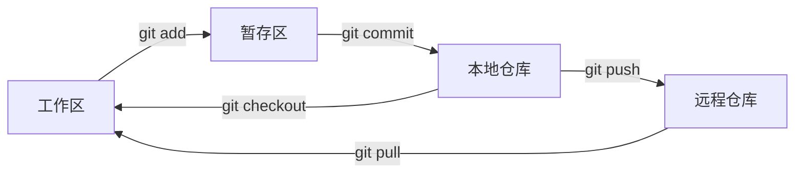

# 前端工程化中的 Git

## Git 基础概念

### 核心工作原理

Git 是一个分布式版本控制系统，具有以下特点：

- **分布式架构**：客户端会完整镜像代码仓库，任何协同工作服务器故障后都可以用本地仓库恢复
- **数据完整性**：通过 SHA-1 散列计算校验和来引用数据，40 位十六进制字符串唯一标识每次提交
- **版本库平等**：项目开始时只有一个原始仓库，其他机器克隆后版本库内容相同，没有主次之分

### Git 工作区域

Git 项目包含四个工作区域：

| 工作区域     | 描述                       | 位置                 |
| ------------ | -------------------------- | -------------------- |
| **工作区**   | 本地编写代码的区域         | 项目根目录           |
| **暂存区**   | 临时存放修改文件的区域     | `.git/index` 文件    |
| **本地仓库** | 存储项目元数据和对象数据库 | `.git` 目录          |
| **远程仓库** | 托管在网络上的版本仓库     | GitHub/GitLab 等平台 |

### 基本工作流程



基本流程：

1. 克隆资源作为工作目录
2. 添加/修改文件
3. 将修改添加到暂存区
4. 提交前查看修改
5. 提交修改到本地仓库
6. 推送到远程仓库
7. 必要时撤回修改

## Git 分支管理

### 常见分支策略

#### 1. Git Flow

适用于版本发布项目，包含两个长期分支和三个临时分支：

**长期分支：**

- `master`：发布稳定版本
- `develop`：最新开发代码

**临时分支：**

- `feature/*`：功能开发分支
- `release/*`：预发布分支
- `hotfix/*`：紧急 Bug 修复分支

```mermaid
gitgraph
    commit id: "Initial"
    branch develop
    checkout develop
    commit id: "Dev 1"
    branch feature/login
    checkout feature/login
    commit id: "Login feature"
    checkout develop
    merge feature/login
    branch release/1.0
    checkout release/1.0
    commit id: "Bug fixes"
    checkout main
    merge release/1.0 tag: "v1.0"
    checkout develop
    merge release/1.0
```

#### 2. GitHub Flow

适用于持续部署项目：

1. 从 `main` 分支拉取新分支开发
2. 完成后发起 Pull Request
3. 经过代码审查后合并到 `main`
4. 部署到生产环境

#### 3. GitLab Flow

遵循"上游优先"原则：

- 只存在一个主分支 `master`
- `master` 是其他分支的 upstream
- 代码变化必须由上游向下游发展

### 分支操作命令

```bash
# 查看分支
git branch                    # 查看本地分支
git branch -r                # 查看远程分支
git branch -a                # 查看所有分支

# 创建和切换分支
git branch feature/login      # 创建分支
git checkout feature/login    # 切换分支
git checkout -b feature/login # 创建并切换分支

# 合并分支
git checkout main
git merge feature/login       # 合并分支

# 删除分支
git branch -d feature/login   # 删除本地分支
git push origin --delete feature/login  # 删除远程分支
```

## 高级操作

### `git merge` vs `git rebase`

| 特性         | git merge                  | git rebase               |
| ------------ | -------------------------- | ------------------------ |
| **提交历史** | 保留分支历史，产生合并提交 | 线性历史，重写提交历史   |
| **冲突处理** | 一次性解决所有冲突         | 逐个提交解决冲突         |
| **使用场景** | 功能分支合并到主分支       | 整理提交历史，同步主分支 |
| **协作影响** | 对已推送的提交安全         | 不要对已推送的提交使用   |

#### Merge 示例

```bash
git checkout main
git merge feature/login
# 产生一个合并提交
```

#### Rebase 示例

```bash
git checkout feature/login
git rebase main
# 将 feature/login 的提交重新应用到 main 之上
```

### 版本回退与冲突解决

#### 版本回退方式

```bash
# 1. 重置到指定提交（危险操作）
git reset --hard <commit-hash>    # 完全重置
git reset --soft <commit-hash>    # 保留工作区和暂存区
git reset --mixed <commit-hash>   # 保留工作区，清空暂存区

# 2. 撤销提交（安全操作）
git revert <commit-hash>          # 创建新提交来撤销指定提交

# 3. 临时保存和恢复
git stash                         # 暂存当前修改
git stash pop                     # 恢复暂存的修改
git stash list                    # 查看暂存列表
```

#### 冲突解决流程

1. **合并时遇到冲突**

```bash
git merge feature/login
# Auto-merging file.txt
# CONFLICT (content): Merge conflict in file.txt
```

2. **手动解决冲突**

```bash
# 打开冲突文件，找到冲突标记
<<<<<<< HEAD
// 当前分支的代码
=======
// 要合并分支的代码
>>>>>>> feature/login
```

3. **完成合并**

```bash
git add .                         # 添加解决后的文件
git commit                        # 完成合并提交
```

## 前端工程化中的 Git 最佳实践

### 1. 提交规范

使用约定式提交（Conventional Commits）：

```bash
# 格式：<type>[optional scope]: <description>
git commit -m "feat(auth): add login functionality"
git commit -m "fix(ui): resolve button alignment issue"
git commit -m "docs: update API documentation"
```

**常用类型：**

- `feat`: 新功能
- `fix`: Bug 修复
- `docs`: 文档更新
- `style`: 代码格式调整
- `refactor`: 代码重构
- `test`: 测试相关
- `chore`: 构建过程或辅助工具的变动

### 2. 分支命名规范

```bash
# 功能分支
feature/user-authentication
feature/payment-integration

# 修复分支
fix/header-layout-bug
hotfix/critical-security-patch

# 发布分支
release/v1.2.0
```

### 3. .gitignore 配置

```bash
# 依赖目录
node_modules/
npm-debug.log*

# 构建输出
dist/
build/
.nuxt/

# 环境配置
.env
.env.local
.env.production

# IDE 配置
.vscode/
.idea/

# 缓存文件
.cache/
.parcel-cache/
```

### 4. Git Hooks 应用

使用 Husky 进行代码质量控制：

```json
{
  "husky": {
    "hooks": {
      "pre-commit": "lint-staged",
      "commit-msg": "commitlint -E HUSKY_GIT_PARAMS"
    }
  },
  "lint-staged": {
    "*.{js,jsx,ts,tsx}": ["eslint --fix", "prettier --write"]
  }
}
```

### 5. 团队协作流程

1. **功能开发流程**

```bash
# 1. 拉取最新代码
git checkout main
git pull origin main

# 2. 创建功能分支
git checkout -b feature/new-component

# 3. 开发完成后推送
git add .
git commit -m "feat: add new component"
git push origin feature/new-component

# 4. 创建 Pull Request
# 5. 代码审查和合并
```

2. **热修复流程**

```bash
# 从 main 分支创建热修复分支
git checkout main
git checkout -b hotfix/critical-bug

# 修复后直接合并到 main 和 develop
git checkout main
git merge hotfix/critical-bug
git checkout develop
git merge hotfix/critical-bug
```

### 6. 常用 Git 别名配置

```bash
git config --global alias.co checkout
git config --global alias.br branch
git config --global alias.ci commit
git config --global alias.st status
git config --global alias.lg "log --oneline --graph --decorate"
```
